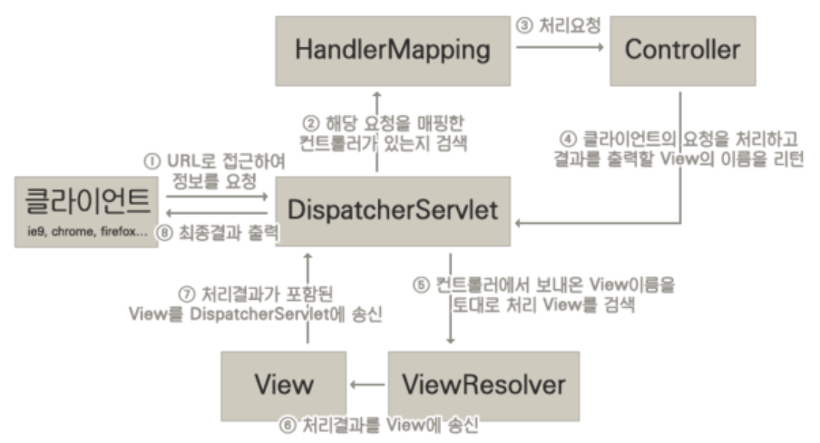

# DispatcherServlet

Servlet Container에서 HTTP프로토콜을 통해 들어오는 모든 요청을 프레젠테이션 계층의 제일 앞에 둬서 처리해주는 프론트 컨트롤러
+
## DispatcherServlet 초기화
+ 다음의 특별한 타입의 빈들을 찾거나, 기본 전략에 해당하는 빈들을 등록한다.
+ HandlerMapping: 핸들러를 찾아주는 인터페이스
+ HandlerAdapter: 핸들러를 실행하는 인터페이스
+ HandlerExceptionResolver: 구현체가 컨트롤러가 실행되는 중 발생한 의도치 않은 예외를 다룸
+ ViewResolver: view이름으로부터 사용할 view 오브젝트를 매핑
+ ...
        

## DispatcherServlet 동작순서

1. 요청을 분석한다. (로케일, 테마, 멀티파트 등)
2. (핸들러 맵핑에게 위임하여) 요청을 처리할 핸들러를 찾는다.
3. (등록되어 있는 핸들러 어댑터 중에) 해당 핸들러를 실행할 수 있는 "핸들러 어댑터"를 찾는다.
4. 찾아낸 "핸들러 어댑터"를 사용해서 핸들러의 응답을 처리한다.
    + 핸들러의 리턴값을 보고 어떻게 처리할지 판단한다.
        + 뷰 이름에 해당하는 뷰를 찾아서 모델 데이터를 랜더링한다.
        + @ResponseEntity가 있다면 Converter를 사용해서 응답 본문을 만들고
5. (부가적으로) 예외가 발생했다면, 예외 처리 핸들러에 요청 처리를 위임한다.
6. 최종적으로 응답을 보낸다.

## HandlerMapping
+ RequestMappingHandlerMapping: 실질적으로 애노테이션, 컨트롤러와 request맵핑 등등을 사용해서 핸들러로 지정한 핸들러를 찾아줌
+ BeanNameUrlHandlerMapping: 요청 URI와 동일한 이름을 가진 Controller 빈을 매핑한다.

## HandlerAdapter
+ RequestMappingHandlerAdapter
+ SimpleControllerHandlerAdapter: 

## ViewResolver
+ InternalResourceViewResolver

## InternalResourceViewResolver
+ Prefix
+ Suffix
